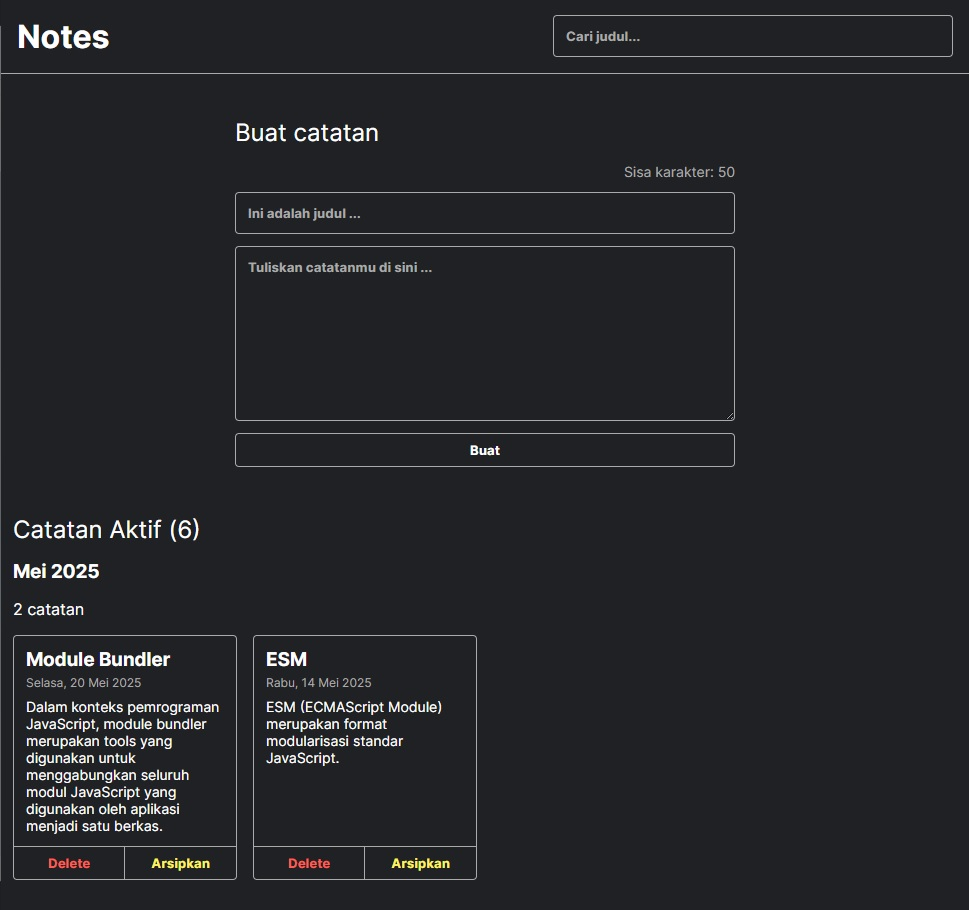

# My Personal Notes

Aplikasi dibangun menggunakan ekosistem Vite dengan memanfaatkan templat yang disediakan oleh Vite.

Pemilihan library/framework aplikasi menggunakan React.

Bahasa pemrograman yang digunakan adalah JavaScript.

React component dibuat menggunakan _functional component_ dan _class component_.

Membuat React element menggunakan sintaksis JSX.

Menggunakan **state komponen React** untuk menyimpan data atau informasi dinamis yang privat di dalam komponen.
